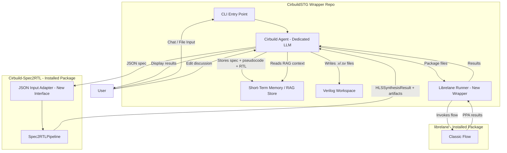
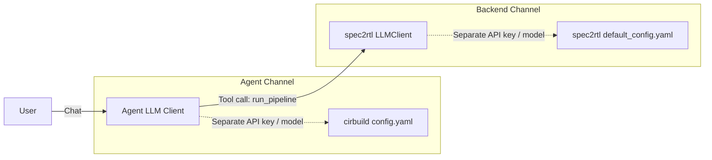
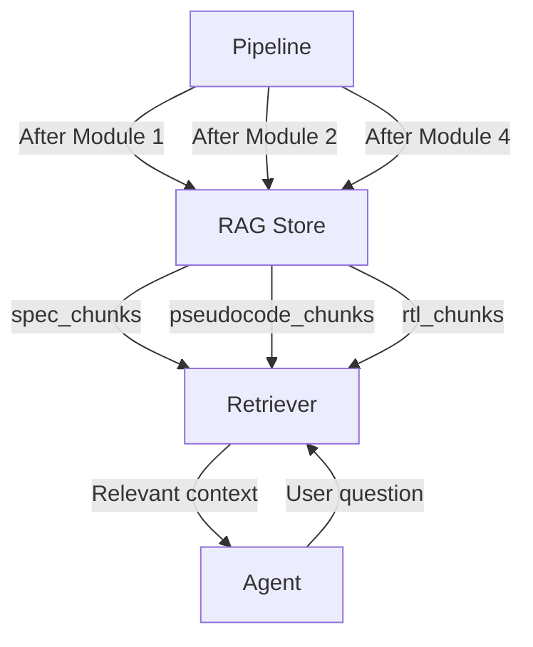
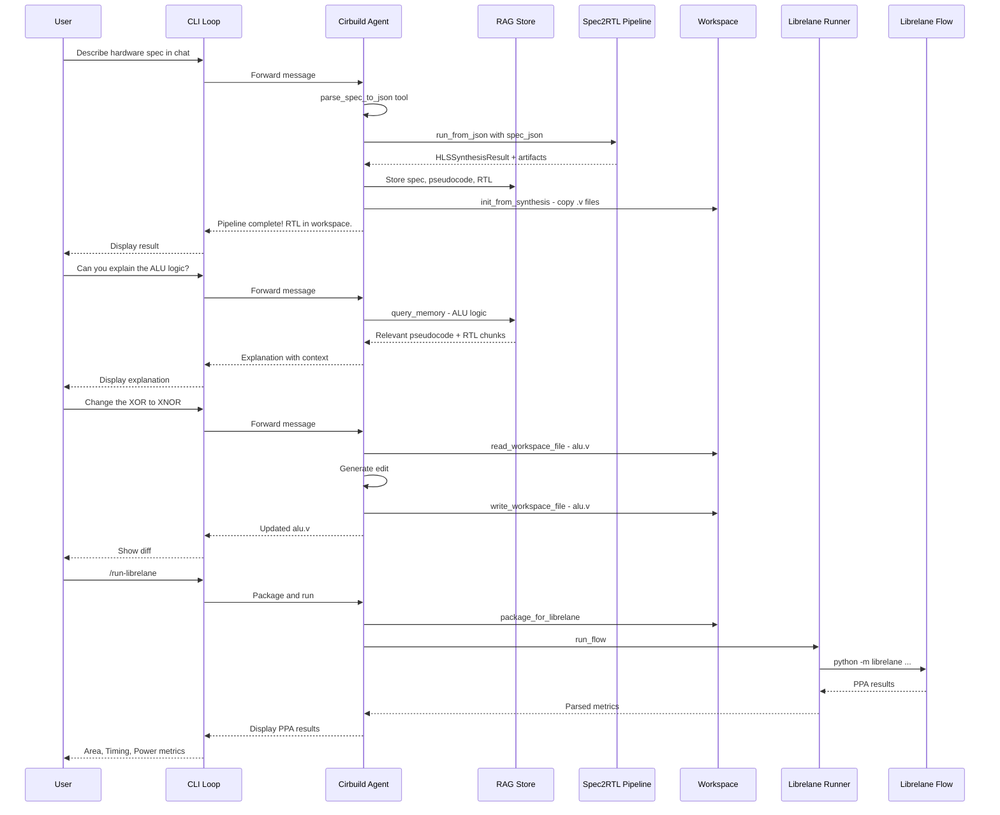

# Cirbuild Agent — Spec2RTL & Librelane Integration Plan

> **Version:** 0.1  
> **Scope:** CirbuildSTG wrapper repo integration with spec2rtl backend and librelane physical design flow  
> **Principle:** Minimal edits to spec2rtl codebase; all orchestration lives in CirbuildSTG

---

## Status

| Phase | Description | Status |
|-------|-------------|--------|
| Phase 0 | Spec2RTL JSON adapter (`run_from_json`, `--json` flag) | ✅ Complete |
| Phase 1 | Foundation — Package structure, settings, pipeline bridge | ✅ Complete |
| Phase 2 | Agent Core — LLM client, tool definitions, CLI chat loop | ✅ Complete |
| Phase 3 | Memory & Workspace — BM25 RAG store, workspace manager | ✅ Complete |
| Phase 4 | Librelane Integration — Runner, config gen, flow execution | ✅ Complete |
| Phase 5 | Polish & Documentation — README, pyproject.toml, consistency | ✅ Complete |

**All phases are complete as of v0.1.**

---

## What Was Built

### CirbuildSTG Package (`cirbuild/`)

A fully functional CLI-based AI agent for IC design, consisting of:

- **`agent/client.py`** — `CirbuildAgent` class with dedicated LLM channel (via LiteLLM), tool-calling loop with up to 5 rounds, conversation history management, and fallback model support.

- **`agent/tools.py`** — 9 tool definitions in OpenAI function-calling format with real handler implementations:
  - `parse_spec_to_json` — LLM-powered natural language → JSON spec parsing with Pydantic validation
  - `run_spec2rtl_pipeline` — JSON spec → RTL via Spec2RTL backend, with auto-store to RAG and auto-init workspace
  - `run_spec2rtl_from_file` — File-based pipeline execution (PDF, TXT, JSON)
  - `query_memory` — BM25 keyword search over stored pipeline artifacts
  - `read_workspace_file` / `write_workspace_file` / `list_workspace_files` — Workspace CRUD with history
  - `package_for_librelane` — Workspace → Librelane design directory packaging with config generation
  - `run_librelane_flow` — Subprocess-based Librelane execution with result parsing

- **`cli.py`** — Interactive Rich-powered chat loop with `/command` dispatch (8 commands) and natural language routing to the agent.

- **`config/settings.py`** — `CirbuildSettings` (Pydantic BaseSettings) with YAML loading, environment variable overrides (`CIRBUILD_` prefix), and `.env` support.

- **`memory/rag_store.py`** — `RAGStore` with BM25 scoring, three namespaces (spec/pseudocode/rtl), overlapping chunk splitting, and hardware-aware tokenization.

- **`workspace/manager.py`** — `WorkspaceManager` with module-scoped directories, automatic history snapshots, and Librelane packaging.

- **`pipeline/bridge.py`** — `Spec2RTLBridge` with lazy pipeline initialization, JSON/file/text input support, and `PipelineArtifacts` capture.

- **`pipeline/json_spec.py`** — `JsonHardwareSpec` Pydantic model for structured hardware specification validation.

- **`librelane/runner.py`** — `LibrelaneRunner` with config.yaml generation (sky130/gf180 PDK support), subprocess invocation, run checkpoint detection, and PPA result parsing.

### Changes to Spec2RTL Backend (`Cirbuild-Spec2RTL/spec2rtl/`)

- **`pipeline.py`** — Added `run_from_json()` and `_json_to_spec_text()` methods (additive only, ~40 lines)
- **`__main__.py`** — Added `--json` CLI flag (additive only, ~10 lines)

**Total impact on spec2rtl: 2 files, ~50 lines added, 0 lines modified.**

---

## 1. Architecture Overview

The Cirbuild agent is a **CLI chat-loop client** that sits in the CirbuildSTG repo and orchestrates two backend subsystems:

1. **spec2rtl** — Spec-to-RTL HLS pipeline (existing, in `Cirbuild-Spec2RTL`)
2. **librelane** — RTL-to-GDSII physical design flow (existing, in `librelane`)

The agent uses its **own dedicated LLM API channel** (separate from the spec2rtl backend LLM) for user interaction, RAG, and debugging assistance.



---

## 2. Repository Structure — CirbuildSTG

```
CirbuildSTG/
├── cirbuild/
│   ├── __init__.py
│   ├── __main__.py              # CLI entry: python -m cirbuild
│   ├── cli.py                   # CLI chat loop + command dispatch
│   ├── agent/
│   │   ├── __init__.py
│   │   ├── client.py            # Cirbuild LLM agent - dedicated API
│   │   ├── tools.py             # Agent tool definitions
│   │   └── prompts/
│   │       ├── system.jinja2    # Agent system prompt
│   │       └── rag_query.jinja2 # RAG-augmented query template
│   ├── memory/
│   │   ├── __init__.py
│   │   └── rag_store.py         # Short-term memory / RAG store
│   ├── pipeline/
│   │   ├── __init__.py
│   │   ├── bridge.py            # Spec2RTL pipeline bridge
│   │   └── json_spec.py         # JSON spec schema + validation
│   ├── workspace/
│   │   ├── __init__.py
│   │   └── manager.py           # Verilog workspace manager
│   ├── librelane/
│   │   ├── __init__.py
│   │   └── runner.py            # Librelane flow runner
│   └── config/
│       ├── __init__.py
│       ├── settings.py          # CirbuildSTG settings - separate from spec2rtl
│       └── default_config.yaml
├── plans/
├── requirements.txt
├── pyproject.toml
└── README.md
```

---

## 3. Component Design

### 3.1 JSON Input Adapter for spec2rtl — Minimal Codebase Edit

**Location:** `Cirbuild-Spec2RTL/spec2rtl/pipeline.py` — add one new method  
**Rationale:** The pipeline currently accepts PDF via [`run()`](../Cirbuild-Spec2RTL/spec2rtl/pipeline.py:74) and raw text via [`run_from_text()`](../Cirbuild-Spec2RTL/spec2rtl/pipeline.py:145). Adding a `run_from_json()` method makes JSON a native input format without altering existing methods.

#### JSON Spec Schema

```json
{
  "module_name": "ALU",
  "description": "A 32-bit Arithmetic Logic Unit supporting ADD, SUB, AND, OR, XOR operations",
  "inputs": {
    "a": "32-bit unsigned",
    "b": "32-bit unsigned",
    "op": "3-bit operation selector"
  },
  "outputs": {
    "result": "32-bit unsigned",
    "zero_flag": "1-bit"
  },
  "behavior": "When op=000: result=a+b, op=001: result=a-b, op=010: result=a&b, op=011: result=a|b, op=100: result=a^b. zero_flag is set when result is 0.",
  "constraints": [
    "Purely combinational",
    "No clock or reset signals"
  ],
  "classification": "COMBINATIONAL"
}
```

#### Changes to spec2rtl

**File:** [`pipeline.py`](../Cirbuild-Spec2RTL/spec2rtl/pipeline.py:39) — Add `run_from_json()` method to `Spec2RTLPipeline`:

```python
def run_from_json(
    self,
    spec_json: dict,
    target_compiler: str | None = None,
) -> HLSSynthesisResult:
    """Execute the pipeline from a JSON specification object.

    Converts the structured JSON into a text representation
    and delegates to run_from_text(). This enables programmatic
    invocation from the Cirbuild agent client.

    Args:
        spec_json: Dictionary with keys: module_name, description,
            inputs, outputs, behavior, constraints, classification.
        target_compiler: Override the configured compiler.

    Returns:
        HLSSynthesisResult with the path to generated RTL.
    """
    spec_text = self._json_to_spec_text(spec_json)
    return self.run_from_text(spec_text, target_compiler)

@staticmethod
def _json_to_spec_text(spec_json: dict) -> str:
    """Convert a JSON spec dict into a natural-language spec string."""
    parts = []
    parts.append(f"Module Name: {spec_json.get('module_name', 'Unknown')}")
    parts.append(f"\nDescription:\n{spec_json.get('description', '')}")
    
    if inputs := spec_json.get("inputs"):
        parts.append("\nInputs:")
        for name, desc in inputs.items():
            parts.append(f"  - {name}: {desc}")
    
    if outputs := spec_json.get("outputs"):
        parts.append("\nOutputs:")
        for name, desc in outputs.items():
            parts.append(f"  - {name}: {desc}")
    
    if behavior := spec_json.get("behavior"):
        parts.append(f"\nBehavior:\n{behavior}")
    
    if constraints := spec_json.get("constraints"):
        parts.append("\nConstraints:")
        for c in constraints:
            parts.append(f"  - {c}")
    
    if classification := spec_json.get("classification"):
        parts.append(f"\nHardware Classification: {classification}")
    
    return "\n".join(parts)
```

**File:** [`__main__.py`](../Cirbuild-Spec2RTL/spec2rtl/__main__.py:1) — Add `--json` flag to CLI:

```python
parser.add_argument(
    "--json",
    action="store_true",
    help="Treat the --spec file as a JSON specification object.",
)
```

And in the execution block, add a branch for JSON:

```python
if args.json:
    import json
    spec_json = json.loads(args.spec.read_text(encoding="utf-8"))
    result = pipeline.run_from_json(spec_json=spec_json, target_compiler=args.compiler)
```

**Impact:** Two additions to existing files. No existing behavior is modified. The pipeline remains fully standalone.

---

### 3.2 Cirbuild Agent Client — Dedicated LLM Channel

**Location:** `CirbuildSTG/cirbuild/agent/client.py`

The agent uses a **separate LLM API configuration** from the spec2rtl backend. This ensures:
- Independent rate limiting and model selection
- Agent-specific system prompts and tool definitions
- No interference with the backend pipeline's LLM calls



#### Agent Configuration — `cirbuild/config/default_config.yaml`

```yaml
# Cirbuild Agent Configuration (separate from spec2rtl backend)
agent:
  model: "openrouter/anthropic/claude-sonnet-4"
  fallback_models:
    - "openrouter/google/gemini-2.5-flash"
  temperature: 0.3
  max_tokens: 4096

# Workspace
workspace_dir: "cirbuild_workspace"

# Librelane
librelane_repo_path: "../librelane"
librelane_pdk_root: "~/.ciel"
librelane_pdk: "sky130A"

# Spec2RTL backend (uses its own config internally)
spec2rtl_config_path: null  # Uses spec2rtl defaults
```

#### Agent Tool Definitions — `cirbuild/agent/tools.py`

The agent is equipped with tools that map to the six objectives:

| Tool | Description | Maps to Objective |
|------|-------------|-------------------|
| `parse_spec_to_json` | Parse user natural-language spec into JSON schema | Obj 1 |
| `run_spec2rtl_pipeline` | Execute the spec2rtl pipeline with JSON input | Obj 1 |
| `query_memory` | RAG query against short-term memory store | Obj 2 |
| `read_workspace_file` | Read a file from the Verilog workspace | Obj 3 |
| `write_workspace_file` | Write/edit a file in the Verilog workspace | Obj 3 |
| `list_workspace_files` | List files in the workspace | Obj 3 |
| `package_for_librelane` | Copy workspace files to librelane design dir | Obj 5 |
| `run_librelane_flow` | Execute the librelane Classic flow | Obj 6 |

---

### 3.3 Short-Term Memory / RAG Store

**Location:** `CirbuildSTG/cirbuild/memory/rag_store.py`

Instance-scoped, runtime-only memory that stores:

1. **Spec content** — The original specification (JSON or text)
2. **Pseudocode plan** — The `DecompositionPlan` and `PseudocodePlan` from Module 1-2
3. **Final RTL** — The generated Verilog/SystemVerilog output



#### Implementation Strategy

- Use a simple **in-memory vector store** with sentence embeddings (e.g., `sentence-transformers` or LLM-based embedding via the agent's API)
- Alternatively, for simplicity in v0.1: use **keyword-based chunked retrieval** (no embedding model needed) — split stored artifacts into chunks and do TF-IDF or BM25 matching
- The store is **ephemeral** — cleared on each new session or pipeline run
- Three namespaces: `spec`, `pseudocode`, `rtl`

---

### 3.4 Verilog Workspace Manager

**Location:** `CirbuildSTG/cirbuild/workspace/manager.py`

A dedicated directory where the agent can:
- Copy RTL output from the spec2rtl build directory
- Allow the user to discuss and request edits
- The agent writes modifications directly to `.v` / `.sv` files
- Track edit history for undo capability

```
cirbuild_workspace/
├── <module_name>/
│   ├── <module_name>.v          # Main RTL file
│   ├── <module_name>_tb.v       # Testbench (if generated)
│   └── .history/                # Edit snapshots
│       ├── 001_<module_name>.v
│       └── 002_<module_name>.v
```

#### Key Methods

```python
class WorkspaceManager:
    def init_from_synthesis(self, result: HLSSynthesisResult, module_name: str) -> Path
    def read_file(self, filename: str) -> str
    def write_file(self, filename: str, content: str) -> Path
    def list_files(self) -> list[str]
    def get_history(self, filename: str) -> list[Path]
    def package_for_librelane(self, target_dir: Path) -> list[Path]
```

---

### 3.5 Librelane Runner — New Wrapper in CirbuildSTG

**Location:** `CirbuildSTG/cirbuild/librelane/runner.py`

This replaces the stub in spec2rtl. The runner:
1. Generates a librelane `config.yaml` from the workspace RTL files
2. Invokes `python -m librelane` as a subprocess
3. Parses the output for PPA metrics

#### Config Generation

Based on the librelane [spm example config](../librelane/librelane/examples/spm/config.yaml:1), the minimum required config is:

```yaml
DESIGN_NAME: <module_name>
VERILOG_FILES: dir::src/*.v
CLOCK_PERIOD: <user_specified or default 10>
CLOCK_PORT: <detected or user_specified>
```

#### Invocation

```python
def run_flow(self, config_path: Path, pdk: str = "sky130A") -> dict:
    cmd = [
        sys.executable, "-m", "librelane",
        "--pdk-root", str(self.pdk_root),
        "--pdk", pdk,
        str(config_path),
    ]
    result = subprocess.run(cmd, capture_output=True, text=True, cwd=str(self.design_dir))
    return self._parse_results(result)
```

#### Design Directory Structure

```
cirbuild_workspace/<module_name>/librelane_design/
├── config.yaml
├── src/
│   └── <module_name>.v
└── runs/                    # Created by librelane
    └── <tag>/
        └── ... (GDSII, reports, etc.)
```

---

### 3.6 CLI Chat Loop

**Location:** `CirbuildSTG/cirbuild/cli.py`

A synchronous stdin/stdout chat loop that:
1. Accepts user messages
2. Routes them through the Cirbuild agent
3. Displays agent responses and pipeline status
4. Supports special commands for direct actions

#### Command Dispatch

| Command | Action |
|---------|--------|
| `/spec <file>` | Load a spec file (PDF, TXT, or JSON) and run pipeline |
| `/workspace` | List files in the Verilog workspace |
| `/edit <file>` | Open a file for discussion-based editing |
| `/package` | Package workspace for librelane |
| `/run-librelane` | Execute the librelane flow |
| `/status` | Show current pipeline/workspace status |
| `/clear` | Clear the session memory |
| `/quit` | Exit the agent |

Regular messages (without `/` prefix) are routed to the agent for natural conversation, which may trigger tool calls internally.

---

## 4. Data Flow — End-to-End



---

## 5. Changes to spec2rtl Codebase — Summary

| File | Change | Impact |
|------|--------|--------|
| [`pipeline.py`](../Cirbuild-Spec2RTL/spec2rtl/pipeline.py:39) | Add `run_from_json()` and `_json_to_spec_text()` methods | Additive only — no existing behavior changed |
| [`__main__.py`](../Cirbuild-Spec2RTL/spec2rtl/__main__.py:1) | Add `--json` CLI flag | Additive only — existing flags unchanged |

**Total: 2 files, ~50 lines added, 0 lines modified.**

The spec2rtl pipeline remains fully functional as a standalone tool. The JSON interface is simply a new entry point that converts to the existing text-based flow.

---

## 6. Dependency Map

### CirbuildSTG `requirements.txt`

```
# Spec2RTL backend (installed as package)
git+https://github.com/CirbuildProject/Cirbuild-Spec2RTL.git@main

# Cirbuild Agent LLM (separate from backend)
litellm>=1.0.0
openai>=1.0.0

# RAG / Memory
# Option A: Lightweight keyword-based (no extra deps)
# Option B: Embedding-based
# sentence-transformers>=2.0.0  # Only if using embeddings

# CLI
rich>=13.0.0
pydantic>=2.0.0
pydantic-settings>=2.0.0
pyyaml>=6.0
jinja2>=3.0.0
python-dotenv>=1.0.0

# Librelane (installed separately or as editable)
# pip install -e ../librelane
```

---

## 7. Implementation Phases

### Phase 1: Foundation
- JSON input adapter in spec2rtl (`run_from_json`, `--json` flag)
- CirbuildSTG package structure (`cirbuild/` module)
- Settings and configuration (`cirbuild/config/`)
- Pipeline bridge (`cirbuild/pipeline/bridge.py`)

### Phase 2: Agent Core
- Agent LLM client with dedicated API channel (`cirbuild/agent/client.py`)
- Tool definitions (`cirbuild/agent/tools.py`)
- CLI chat loop (`cirbuild/cli.py`)
- Entry point (`cirbuild/__main__.py`)

### Phase 3: Memory & Workspace
- RAG store implementation (`cirbuild/memory/rag_store.py`)
- Workspace manager (`cirbuild/workspace/manager.py`)
- Integration of RAG into agent tool calls

### Phase 4: Librelane Integration
- Librelane runner (`cirbuild/librelane/runner.py`)
- Config generation from workspace RTL
- Flow execution and result parsing
- Package command integration

### Phase 5: Polish & Testing
- End-to-end integration tests
- Error handling and edge cases
- Documentation and README updates

---

## 8. Key Design Decisions

| Decision | Rationale |
|----------|-----------|
| **Separate LLM channels** | Prevents agent chat from consuming backend rate limits; allows different models for different tasks |
| **JSON as native spec2rtl input** | Minimal change to spec2rtl; structured format is easier for the agent to produce than free-form text |
| **Subprocess invocation for librelane** | Librelane is a complex tool with its own dependency tree; subprocess isolation prevents conflicts |
| **In-memory RAG only** | Session-scoped memory avoids persistence complexity; each pipeline run is independent |
| **Workspace with history** | Enables undo and diff display during interactive editing sessions |
| **CLI chat loop, not TUI** | Simpler implementation; works in any terminal; can be upgraded to TUI later |

---

*Document Version: v0.1*  
*Project: CirbuildSTG — Spec2RTL & Librelane Integration*
